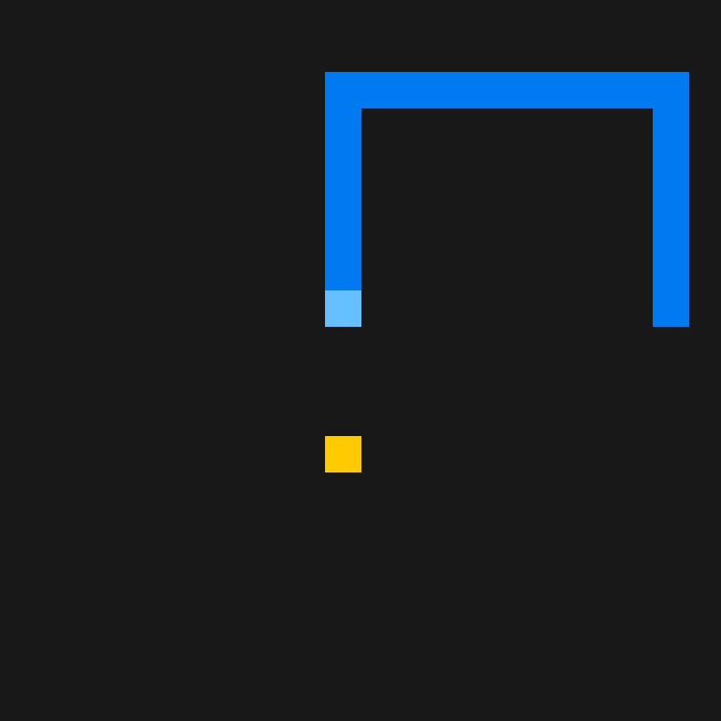

# Snake
Simple snake game with [Raylib](https://raylib.com).

## Build
Download [Raylib v6.0](https://github.com/raysan5/raylib/releases/tag/6.0),
extract the archive and rename the resulting directory to `raylib`. That means
in the project's root directory must be a directory called `raylib`. Then use
`build.sh` on Unix-like platforms and `build.bat` on Win32.

### Win32 Notes
`build.bat` uses Mingw64 GCC compiler that you can download from [HERE](https://winlibs.com).
You must download the `mingw64` version of Raylib in order to use it.

## Photos
